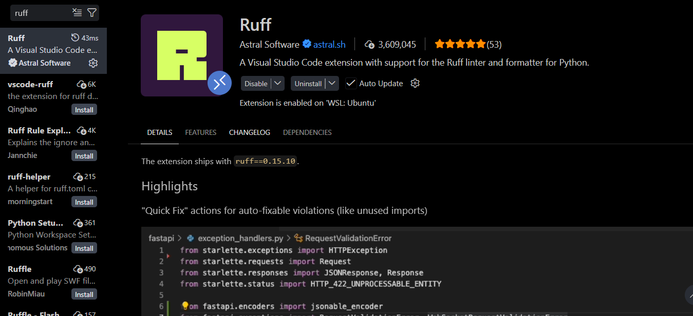

# Projeto 3 Programação Eficaz ( BACKEND ) - Super Awesome Team

[](https://flask.palletsprojects.com/) [](https://docs.astral.sh/uv/)

Este repositório contém o backend do Projeto 3 da disciplina de Programação Eficaz.

## Equipe

- Brenda Lima
- Mateus Ahn
- Miqueias Ayron
- Pedro Pereira
- Victor Costa

<br>
<br>
<br>

## Comandos GIT

- Listar `branchs` locais:

```bash
    git branch
```

- Criar nova `branch` localmente:

```bash
    git branch nome-da-branch
```

- Mudar para outra `branch`:

```bash
    git switch nome-da-outra-branch
```

- Criar `branch` e já mudar para a nova `branch`:

```bash
    git checkout -b nome-da-branch
```

- Deletar `branch` localmente:

```bash
    git branch -D nome-da-branch
```

- Deletar `branch` do repositório remoto ( github ):

```bash
    git push origin --delete nome-da-branch
```

- Verificar status de local changes:

```bash
    git status
```

- Escolher arquivos alterados que serão commitados ( adiciona à `Staging Area`):

```bash
    git add nome-do-arquivo1 nome-do-arquivo2 nome_do_arquivo3
```

- Adicionar Diretório ( Pasta ) à `Staging Area`:

```bash
    git add nome-da-pasta/
```

- Adicionar TODAS as alterações do diretório atual na `Staging Area`:

```bash
    git add .
```

- Adiconar arquivos por extensão à `Staging Area`:
  - Ex:

  ```bash
  git add *.css
  ```

  Adicona todos os arquivos CSS.

- Commita na `branch` atual ( Sobe para o Repositório Local )

```bash
    git commit -m 'nome-do-commit'
```

                        │
                        ▼

- Subir `branch` para o repositório remoto ( github ):

```bash
    git push -u origin nome-da-branch
```

<br>
<br>
<br>

## Instruções de sincronização e instalação de dependências

Usaremos o gerenciador de pacotes Python `uv`. Se você ainda não tem o `uv` na sua máquina, execute no terminal:

```shell
pip install uv
```

Ou, caso não tenha o Python configurado como variável de ambiente:

```shell
py -m pip install uv
```

Após a instalação, abra o terminal e execute, no diretório do projeto:

```shell
uv sync
```

- Isso vai criar um ambiente virtual com todas as dependências contidas no arquivo `uv.lock`.
- Você não precisa ativar o ambiente manualmente. Sempre que abrir o terminal, o ambiente será inicializado automaticamente.

Para instalar uma nova dependência, execute:

```shell
uv add nome-da-biblioteca
```

- A dependência instalada é automaticamente listada no `uv.lock`, então, quando você fizer um _commit_, isso sobe para o repositório remoto.
- Quando outro membro da equipe fizer _pull_, basta usar `uv sync` para sincronizar as dependências contidas no `uv.lock` com o ambiente virtual e tudo estará pronto.

Em caso de dúvida, clique nos ícones do topo para acessar as respectivas documentações.

<br>
<br>
<br>

## Configuracao do .env

```py
    MONGODB_URI=mongodb+srv://usuario:<senha>@project3.7pbdixa.mongodb.net/?appName=project3
    SECRET_KEY=troque-esse-valor
    JWT_SECRET_KEY=troque-esse-valor
    BASE_URL=http://localhost:5000
    APP_URL=http://localhost:5173
    FRONTEND_URL=http://localhost:5173
    CORS_ORIGINS=http://localhost:5173,http://127.0.0.1:5173
    FRONTEND_AUTH_CALLBACK_URL=http://localhost:5173/auth/callback
    FRONTEND_EMAIL_VERIFIED_URL=http://localhost:5173/email-verified
    GOOGLE_WEB_CLIENT_ID=placeholder
    GOOGLE_WEB_CLIENT_SECRET=placeholder
    GOOGLE_REDIRECT_URI=http://localhost:5000/auth/google/callback
    CLIENT_ID=placeholder
    CLIENT_SECRET=placeholder
    REFRESH_TOKEN=placeholder
```

## Subindo com o servidor gunicorn

- **desenvolvimento**: servidor single-thread, reload automático ao salvar, mensagens de erro detalhadas no browser ( mas roda síncrono )

```bash
    uv run flask --app wsgi:app run --debug
```

- **produção**: múltiplos workers, gevent, robusto, sem reload automático ( roda assíncrono )

```bash
    uv run gunicorn wsgi:app
```

<br>
<br>
<br>

## Modularização

### Fluxo da Requisição



# Assincronismo no Flask

## Concorrência com Gevent

O gevent usa concorrência cooperativa — uma greenlet só cede o controle quando chega numa operação de I/O (query no banco, chamada HTTP, etc.), e só volta a executar quando essa operação retorna o resultado.

Então dentro de uma requisição, o código continua sequencial:

```py
existing = mongo['users'].find_one(...)  # cede o controle, MAS espera o resultado
if existing:                              # só executa depois do find_one retornar
    return None, {'error': '...'}
```

O gevent permite que outra requisição rode enquanto essa espera o banco, mas **nunca avança para a linha seguinte sem ter o resultado.**

O único lugar onde coisas rodam de forma verdadeiramente paralela é o `gevent.spawn` — que você usou explicitamente para o email, justamente porque ele não afeta a resposta.

O risco real existe entre **requisições diferentes** rodando concorrentemente — por exemplo, dois cadastros com o mesmo email passando no `find_one` ao mesmo tempo antes de qualquer um inserir. Mas isso é um problema de qualquer sistema concorrente, resolvido com índice único no MongoDB, não com controle de concorrência no código.

<br>
<br>
<br>

# Formatador Automático

Instale a extensão `ruff`



<br>
<br>
<br>

# Fluxos Implementados e Dados para o Frontend

### Regras gerais

- Rotas com `@jwt_required` exigem o header:

```http
Authorization: Bearer <token>
```

- O token usado nessas rotas vem do login local ou do login com Google.
- Nos fluxos de recuperação de senha, o frontend precisa guardar o `reset_token` recebido na etapa de validação do código.
- Se `FRONTEND_URL` ou as URLs específicas do frontend estiverem configuradas, a verificação de e-mail e o callback do Google redirecionam para o frontend. Sem essas variáveis, continuam respondendo JSON.

### Autenticação

| Fluxo                          | Endpoint                         | O que o frontend precisa enviar | O que o frontend precisa capturar       |
| ------------------------------ | -------------------------------- | ------------------------------- | --------------------------------------- |
| Login local                    | `POST /auth/login`               | `email`, `password`             | `token`                                 |
| Verificação de e-mail          | `GET /auth/verify-email/<token>` | Nenhum body                     | Redirect com `status` e `message`       |
| Login com Google               | `GET /auth/google`               | Nenhum body                     | Redirecionamento para o Google          |
| Callback do Google             | `GET /auth/google/callback`      | `code` vem na query string      | Redirect com `token` no fragment        |
| Solicitar recuperação de senha | `POST /auth/forgot-password`     | `email`                         | Mensagem genérica de sucesso            |
| Validar código de recuperação  | `POST /auth/verify-reset-code`   | `email`, `code`                 | `reset_token`                           |
| Redefinir senha                | `POST /auth/reset-password`      | `reset_token`, `new_password`   | Mensagem de sucesso                     |

### Usuário

| Fluxo             | Endpoint       | O que o frontend precisa enviar                 | O que o frontend precisa capturar |
| ----------------- | -------------- | ----------------------------------------------- | --------------------------------- |
| Criar usuário     | `POST /user`   | `name`, `email`, `password`, `confirm_password` | Mensagem de sucesso               |
| Usuário logado    | `GET /user/me` | Nenhum body + JWT                               | Dados do usuário autenticado      |
| Atualizar usuário | `PUT /user`    | Campos a alterar + JWT                          | Mensagem de sucesso               |
| Deletar usuário   | `DELETE /user` | `password` para usuário local + JWT             | Mensagem de sucesso               |

Campos opcionais no update de usuário: `name`, `password`, `current_password`.
Se o frontend enviar `password`, também precisa enviar `current_password`.

### Grupo

| Fluxo                 | Endpoint             | O que o frontend precisa enviar                 | O que o frontend precisa capturar |
| --------------------- | -------------------- | ----------------------------------------------- | --------------------------------- |
| Criar grupo           | `POST /group`        | `name`, opcionalmente `members` e `description` | `group_id`                        |
| Listar grupos         | `GET /group`         | Nenhum body + JWT                               | `groups`                          |
| Buscar grupo por ID   | `GET /group/<id>`    | Apenas o id na URL + JWT                        | Grupo completo                    |
| Atualizar grupo       | `PUT /group/<id>`    | Campos a alterar + JWT                          | Grupo atualizado                  |
| Deletar grupo         | `DELETE /group/<id>` | Apenas o id na URL + JWT                        | Mensagem de sucesso               |

O backend adiciona automaticamente o e-mail do usuário logado em `members` se ele não estiver na lista.

### Meta

| Fluxo                     | Endpoint                             | O que o frontend precisa enviar                                             | O que o frontend precisa capturar |
| ------------------------- | ------------------------------------ | --------------------------------------------------------------------------- | --------------------------------- |
| Criar meta                | `POST /goal`                         | `name`, `target_value`, `group_id`, opcionais `due_date`, `description`, `icon`, `members`, `current_value` | `goal_id`                         |
| Listar minhas metas       | `GET /goal`                          | Nenhum body + JWT                                                           | `goals`                           |
| Listar metas do grupo     | `GET /group/<group_id>/goal`         | Apenas o id do grupo na URL + JWT                                           | `goals`                           |
| Buscar meta por ID        | `GET /goal/<goal_id>`                | Apenas o id na URL + JWT                                                    | Meta completa                     |
| Atualizar meta            | `PUT /goal/<goal_id>`                | Campos a alterar + JWT                                                      | Meta atualizada                   |
| Deletar meta              | `DELETE /goal/<goal_id>`             | Apenas o id na URL + JWT                                                    | Mensagem de sucesso               |
| Registrar aporte na meta  | `POST /goal/<goal_id>/contribution`  | `value`, opcionalmente `member_email` e `contributed_at`                    | Meta atualizada                   |

`members` deve ser uma lista de e-mails de membros do grupo. Se omitido, a meta vale para todos os membros do grupo.
`due_date` deve ser enviado em formato de data aceito pelo backend, por exemplo `2026-12-31`.
`contributed_at` deve ser enviado em formato de data/hora aceito pelo backend, por exemplo `2026-05-04T10:00:00Z`.

### Despesa

| Fluxo                      | Endpoint                       | O que o frontend precisa enviar                                | O que o frontend precisa capturar |
| -------------------------- | ------------------------------ | -------------------------------------------------------------- | --------------------------------- |
| Criar despesa              | `POST /expense`                | `expense_type`, `value`, `expense_date`                        | `expense_id`                      |
| Buscar despesa por ID      | `GET /expense/<expense_id>`    | Apenas o id na URL + JWT                                       | Despesa completa                  |
| Listar despesas do usuário | `GET /expense`                 | Nenhum body + JWT                                              | `expenses`                        |
| Atualizar despesa          | `PUT /expense/<expense_id>`    | Campos a alterar + JWT                                         | Despesa atualizada                |
| Deletar despesa            | `DELETE /expense/<expense_id>` | Apenas o id na URL + JWT                                       | Mensagem de sucesso               |

`expense_date` deve ser enviado em formato de data/hora aceito pelo backend.

### Conta

| Fluxo                  | Endpoint                           | O que o frontend precisa enviar                          | O que o frontend precisa capturar |
| ---------------------- | ---------------------------------- | -------------------------------------------------------- | --------------------------------- |
| Criar conta            | `POST /bill`                       | `bill_type`, `total_value`, `group_id`, `members_to_pay` | `bill_id`, `pendencies_created`   |
| Listar contas          | `GET /bill`                        | Nenhum body + JWT                                        | `bills`                           |
| Listar contas do grupo | `GET /group/<group_id>/bill`       | Apenas o id na URL + JWT                                 | `bills`                           |
| Buscar conta por ID    | `GET /bill/<bill_id>`              | Apenas o id na URL + JWT                                 | Conta completa                    |
| Atualizar conta        | `PUT /bill/<bill_id>`              | Campos a alterar + JWT                                   | Conta atualizada                  |
| Deletar conta          | `DELETE /bill/<bill_id>`           | Apenas o id na URL + JWT                                 | Mensagem de sucesso               |
| Marcar conta como paga | `PUT /bill/<bill_id>/mark-as-paid` | Apenas o id na URL + JWT                                 | Mensagem de sucesso               |

`members_to_pay` deve ser uma lista de objetos no formato:

```json
[{ "email": "pessoa@exemplo.com", "value": 25.5 }]
```

### Pendências

| Fluxo                             | Endpoint                                         | O que o frontend precisa enviar | O que o frontend precisa capturar |
| --------------------------------- | ------------------------------------------------ | ------------------------------- | --------------------------------- |
| Listar pendências do usuário      | `GET /pendencies`                                | Nenhum body + JWT               | `as_debtor` e `as_creditor`       |
| Buscar pendência por ID           | `GET /pendencies/<pendency_id>`                  | Apenas o id na URL + JWT        | Pendência completa                |
| Listar pendências de uma conta    | `GET /bill/<bill_id>/pendencies`                 | Apenas o id na URL + JWT        | `pendencies`                      |
| Listar pendências de um grupo     | `GET /group/<group_id>/pendencies`               | Apenas o id na URL + JWT        | `pendencies`                      |
| Confirmar pagamento como devedor  | `PUT /pendencies/<pendency_id>/confirm-debtor`   | Apenas o id na URL + JWT        | Mensagem de confirmação           |
| Confirmar recebimento como credor | `PUT /pendencies/<pendency_id>/confirm-creditor` | Apenas o id na URL + JWT        | Mensagem de confirmação           |

### Resumo do que o frontend precisa persistir

- `token` de autenticação para rotas protegidas.
- `reset_token` do fluxo de recuperação de senha.
- E-mail do usuário logado, se a interface precisar exibir contexto do usuário, embora o backend já extraia isso do JWT.

<br>
<br>
<br>

# Como Testar os fluxos no Postman

### 1. Configuração inicial

Crie uma variável de ambiente no Postman para evitar repetir a URL base:

```text
base_url = http://localhost:5000
```

Quando uma rota retornar `token`, salve esse valor em outra variável de ambiente:

```text
auth_token = <token recebido no login>
```

Para os testes de recuperação de senha, salve também:

```text
reset_token = <token recebido em /auth/verify-reset-code>
```

### 2. Fluxo de autenticação local

1. **Criar usuário**
   - Método: `POST`
   - URL: `{{base_url}}/user`
   - Body (`raw` / `JSON`):

```json
{
  "name": "Nome do Usuário",
  "email": "usuario@exemplo.com",
  "password": "Senha123",
  "confirm_password": "Senha123"
}
```

2. **Confirmar e-mail**
   - Acesse o link recebido no e-mail de verificação.
   - A URL tem o formato:

```text
{{base_url}}/auth/verify-email/<token>
```

3. **Fazer login**
   - Método: `POST`
   - URL: `{{base_url}}/auth/login`
   - Body (`raw` / `JSON`):

```json
{
  "email": "usuario@exemplo.com",
  "password": "Senha123"
}
```

    - Salve o `token` retornado em `auth_token`.

### 3. Fluxo de login com Google

1. **Iniciar login Google**
   - Método: `GET`
   - URL: `{{base_url}}/auth/google`
   - O Postman vai seguir o redirecionamento ou abrir a URL no navegador.

2. **Callback do Google**
   - O backend recebe o `code` na query string.
   - Se você quiser simular manualmente, use a URL recebida pelo Google no callback.
   - Sem `FRONTEND_URL`, a resposta final traz o `token`, que deve ser salvo em `auth_token`.
   - Com `FRONTEND_URL`, o backend redireciona para o frontend com `token` no fragment da URL.

### 4. Fluxo de recuperação de senha

1. **Solicitar código de recuperação**
   - Método: `POST`
   - URL: `{{base_url}}/auth/forgot-password`
   - Body (`raw` / `JSON`):

```json
{
  "email": "usuario@exemplo.com"
}
```

    - A resposta é sempre genérica.
    - O código é enviado por e-mail.

2. **Validar o código**
   - Método: `POST`
   - URL: `{{base_url}}/auth/verify-reset-code`
   - Body (`raw` / `JSON`):

```json
{
  "email": "usuario@exemplo.com",
  "code": "123456"
}
```

    - A resposta traz `reset_token`.
    - Salve esse valor em `reset_token`.

3. **Redefinir a senha**
   - Método: `POST`
   - URL: `{{base_url}}/auth/reset-password`
   - Body (`raw` / `JSON`):

```json
{
  "reset_token": "{{reset_token}}",
  "new_password": "NovaSenha123"
}
```

### 5. Fluxo de usuário (rotas protegidas)

1. **Buscar usuário logado**
   - Método: `GET`
   - URL: `{{base_url}}/user/me`
   - Header:

```http
Authorization: Bearer {{auth_token}}
```

2. **Atualizar usuário**
   - Método: `PUT`
   - URL: `{{base_url}}/user`
   - Header:

```http
Authorization: Bearer {{auth_token}}
```

    - Body (`raw` / `JSON`) exemplo (troca de nome):

```json
{
  "name": "Novo Nome"
}
```

    - Body (`raw` / `JSON`) exemplo (troca de senha):

```json
{
  "password": "NovaSenha123",
  "current_password": "SenhaAtual123"
}
```

3. **Deletar conta (usuário)**
   - Método: `DELETE`
   - URL: `{{base_url}}/user`
   - Header:

```http
Authorization: Bearer {{auth_token}}
```

    - Body (`raw` / `JSON`):

```json
{
  "password": "SenhaAtual123"
}
```

### 6. Fluxo de grupo

1. **Criar grupo**
   - Método: `POST`
   - URL: `{{base_url}}/group`
   - Header:

```http
Authorization: Bearer {{auth_token}}
```

    - Body (`raw` / `JSON`):

```json
{
  "name": "Grupo da viagem",
  "members": ["amigo1@exemplo.com", "amigo2@exemplo.com"],
  "description": "Grupo para dividir despesas da viagem"
}
```

    - Salve o `group_id` retornado para criar contas nesse grupo.

2. **Listar meus grupos**
   - Método: `GET`
   - URL: `{{base_url}}/group`
   - Header com `auth_token`.

3. **Buscar grupo pelo ID**
   - Método: `GET`
   - URL: `{{base_url}}/group/<group_id>`
   - Header com `auth_token`.

4. **Editar grupo**
   - Método: `PUT`
   - URL: `{{base_url}}/group/<group_id>`
   - Header com `auth_token`.
   - Body com os campos que deseja alterar.

5. **Excluir grupo**
   - Método: `DELETE`
   - URL: `{{base_url}}/group/<group_id>`
   - Header com `auth_token`.

### 7. Fluxo de despesa

1. **Criar despesa**
   - Método: `POST`
   - URL: `{{base_url}}/expense`
   - Header:

```http
Authorization: Bearer {{auth_token}}
```

    - Body (`raw` / `JSON`):

```json
{
  "expense_type": "Transporte",
  "value": 120.5,
  "expense_date": "2026-05-02T10:00:00Z"
}
```

2. **Listar minhas despesas**
   - Método: `GET`
   - URL: `{{base_url}}/expense`
   - Header com `auth_token`.

3. **Buscar uma despesa pelo ID**
   - Método: `GET`
   - URL: `{{base_url}}/expense/<expense_id>`
   - Header com `auth_token`.

4. **Editar uma despesa**
   - Método: `PUT`
   - URL: `{{base_url}}/expense/<expense_id>`
   - Header com `auth_token`.
   - Body com apenas os campos que deseja alterar.

5. **Excluir uma despesa**
   - Método: `DELETE`
   - URL: `{{base_url}}/expense/<expense_id>`
   - Header com `auth_token`.

### 8. Fluxo de conta

1. **Criar conta**
   - Método: `POST`
   - URL: `{{base_url}}/bill`
   - Header com `auth_token`.
   - Body (`raw` / `JSON`):

```json
{
  "bill_type": "Almoço",
  "total_value": 100,
  "group_id": "id_do_grupo",
  "members_to_pay": [
    { "email": "amigo1@exemplo.com", "value": 50 },
    { "email": "amigo2@exemplo.com", "value": 50 }
  ]
}
```

2. **Listar minhas contas**
   - Método: `GET`
   - URL: `{{base_url}}/bill`
   - Header com `auth_token`.

3. **Listar contas de um grupo**
   - Método: `GET`
   - URL: `{{base_url}}/group/<group_id>/bill`
   - Header com `auth_token`.

4. **Buscar conta pelo ID**
   - Método: `GET`
   - URL: `{{base_url}}/bill/<bill_id>`
   - Header com `auth_token`.

5. **Editar conta**
   - Método: `PUT`
   - URL: `{{base_url}}/bill/<bill_id>`
   - Header com `auth_token`.
   - Body com os campos que deseja alterar.

6. **Excluir conta**
   - Método: `DELETE`
   - URL: `{{base_url}}/bill/<bill_id>`
   - Header com `auth_token`.

7. **Marcar como paga**
   - Método: `PUT`
   - URL: `{{base_url}}/bill/<bill_id>/mark-as-paid`
   - Header com `auth_token`.

### 9. Fluxo de pendências

1. **Listar minhas pendências**
   - Método: `GET`
   - URL: `{{base_url}}/pendencies`
   - Header com `auth_token`.

2. **Buscar pendência pelo ID**
   - Método: `GET`
   - URL: `{{base_url}}/pendencies/<pendency_id>`
   - Header com `auth_token`.

3. **Listar pendências de uma conta**
   - Método: `GET`
   - URL: `{{base_url}}/bill/<bill_id>/pendencies`
   - Header com `auth_token`.

4. **Listar pendências de um grupo**
   - Método: `GET`
   - URL: `{{base_url}}/group/<group_id>/pendencies`
   - Header com `auth_token`.

5. **Confirmar como devedor**
   - Método: `PUT`
   - URL: `{{base_url}}/pendencies/<pendency_id>/confirm-debtor`
   - Header com `auth_token`.

6. **Confirmar como credor**
   - Método: `PUT`
   - URL: `{{base_url}}/pendencies/<pendency_id>/confirm-creditor`
   - Header com `auth_token`.

### 10. Ordem recomendada de teste

1. Criar usuário.
2. Confirmar e-mail.
3. Fazer login e salvar `auth_token`.
4. Buscar o usuário logado com `GET /user/me`.
5. Criar grupo e salvar `group_id`.
6. Listar ou buscar o grupo criado quando necessário.
7. Criar despesa.
8. Criar conta usando o `group_id`.
9. Listar ou buscar contas.
10. Consultar e confirmar pendências.
11. Testar o fluxo de recuperação de senha por último.
